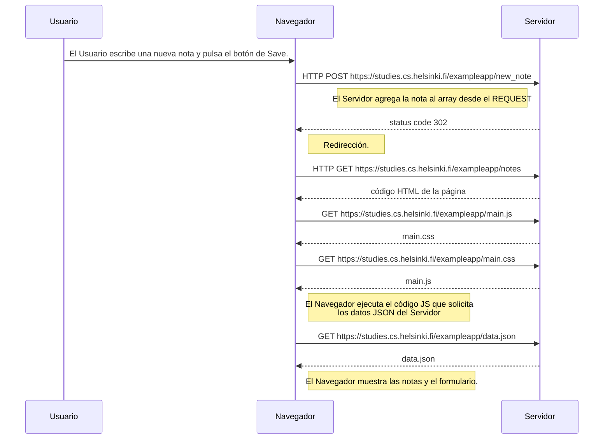

```mermaid
sequenceDiagram
    participant Usuario as Usuario
    participant Navegador as Navegador
    participant Servidor as Servidor

    Usuario->>Navegador: El Usuario escribe una nueva nota y pulsa el botón de Save.
    Navegador->>Servidor: HTTP POST https://studies.cs.helsinki.fi/exampleapp/new_note
    Note left of Servidor: El Servidor agrega la nota al array desde el REQUEST
    Servidor-->>Navegador: status code 302
    Note right of Navegador: Redirección.

    Navegador->>Servidor: HTTP GET https://studies.cs.helsinki.fi/exampleapp/notes
    Servidor-->>Navegador: código HTML de la página

    Navegador->>Servidor: GET https://studies.cs.helsinki.fi/exampleapp/main.js
    Servidor-->>Navegador: main.css

    Navegador->>Servidor: GET https://studies.cs.helsinki.fi/exampleapp/main.css
    Servidor-->>Navegador: main.js
    Note right of Navegador: El Navegador ejecuta el código JS que solicita<br/>los datos JSON del Servidor

    Navegador->>Servidor: GET https://studies.cs.helsinki.fi/exampleapp/data.json
    Servidor-->>Navegador: data.json

    Note right of Navegador: El Navegador muestra las notas y el formulario.
```