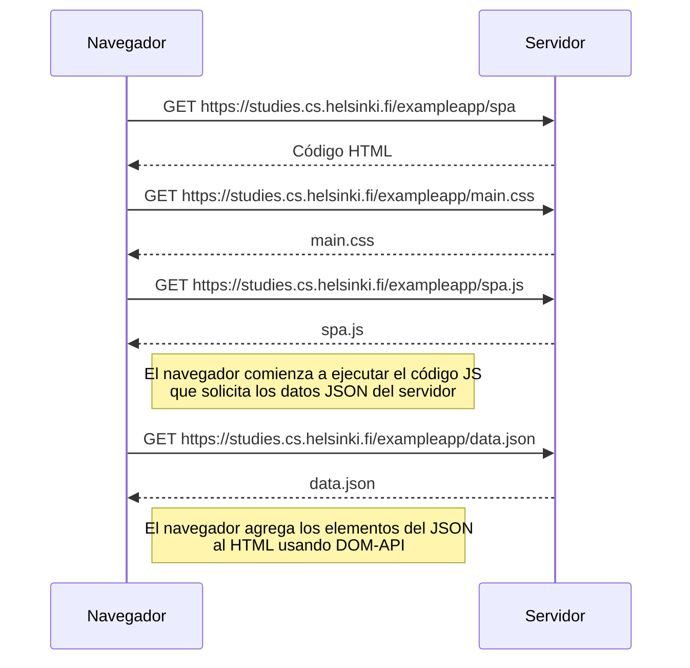

```mermaid
sequenceDiagram
    participant Navegador as Navegador
    participant Servidor as Servidor

    
    Navegador->>Servidor: GET https://studies.cs.helsinki.fi/exampleapp/spa
    Servidor-->>Navegador: Código HTML
    Navegador->>Servidor: GET https://studies.cs.helsinki.fi/exampleapp/main.css
    Servidor-->>Navegador: main.css
    Navegador->>Servidor: GET https://studies.cs.helsinki.fi/exampleapp/spa.js
    Servidor-->>Navegador: spa.js
    Note right of Navegador: El navegador comienza a ejecutar el código JS<br/>que solicita los datos JSON del servidor


    Navegador->>Servidor: GET https://studies.cs.helsinki.fi/exampleapp/data.json
    Servidor-->>Navegador: data.json
    Note right of Navegador: El navegador agrega los elementos del JSON<br/>al HTML usando DOM-API
```