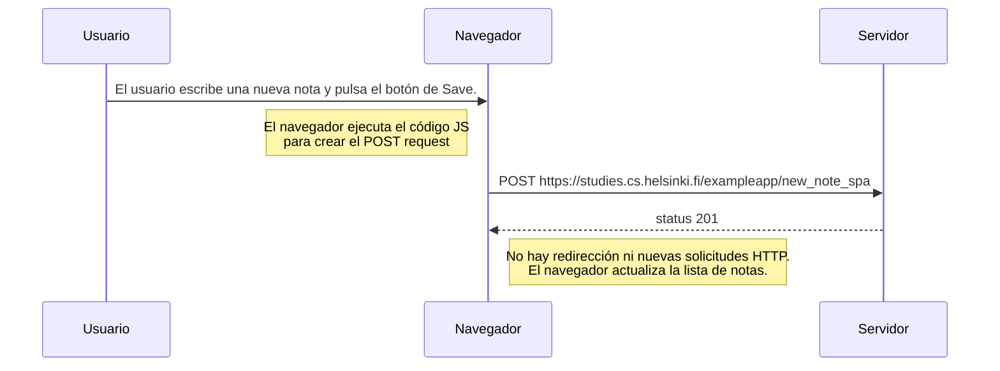

```mermaid
sequenceDiagram
    participant Usuario as Usuario
    participant Navegador as Navegador
    participant Servidor as Servidor

    Usuario->>Navegador: El usuario escribe una nueva nota y pulsa el botón de Save.
    Note left of Navegador: El navegador ejecuta el código JS<br/>para crear el POST request
    Navegador->>Servidor: POST https://studies.cs.helsinki.fi/exampleapp/new_note_spa
    Servidor-->>Navegador: status 201
    Note right of Navegador: No hay redirección ni nuevas solicitudes HTTP.<br/>El navegador actualiza la lista de notas.
```